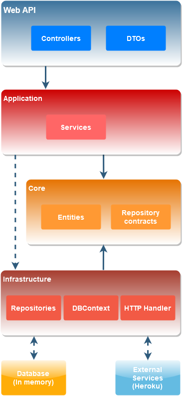

# **International Business Men**

## **Acerca de la solución propuesta**

Al desarrollar la solución tuve en cuenta los siguientes conceptos:

- Clean Architecture
- Hexagonal Architecture
- Principios SOLID
  - Single responsibility principle
  - Open/closed principle
  - Liskov substitution principle
  - Interface segregation principle
  - Dependency inversion principle
- DRY (Don't Repeat Yourself)
- YAGNI (You Aren't Gonna Need It)

Este es un diagrama de las capas de la solución:

También utilicé las siguientes metodologías:

- GitFlow (porque no hay configurado un esquema CI/CD, sino utilizaría Trunk-based Development)
- C# Coding conventions (https://docs.microsoft.com/en-us/dotnet/csharp/fundamentals/coding-style/coding-conventions)
- Conventional commits (https://www.conventionalcommits.org/en/v1.0.0/)
- Semantic versioning para los tags (https://semver.org/)

Para recorer el grafo de las conversiones de moneda utilicé Depth-First Search por considerarlo más adecuado al problema a solucionar que Breadth-First Search.

## **Herramientas**

Las herramientas de desarrollo que usé fueron:

- Visual Studio 2022
- Source Tree
- Postman
- Visual Studio Code (sólo para editar este archivo)

Frameworks y librerías utilizados:

- .NET 6
- Swagger
- Serilog
- Newtonsoft.Json
- AutoMapper
- Entity Framework
- xUnit
- Moq

## **Proceso de análisis y desarrollo**

Las Historias de usuario que obtuve del enunciado son:

- Como ejecutivo quiero obtener todas las conversiones de moneda.
- Como ejecutivo quiero obtener todas las transacciones de los productos.
- Como ejecutivo quiero obtener las transacciones de los productos con sus montos en Euros y filtradas por SKU.

Para satisfacer estas necesidades de los ejecutivos, desarrollé un servicio web REST con 2 controllers (conversion-rates y product-transaction), uno con un endpoint y otro con 2 endpoints.
Si bien estos pueden ejecutarse desde Swagger, agrego al repositorio una colección de Postman para poder consumirlos directamente.

Estructuré la solución en 8 proyectos, 4 del servicio web y 4 de testing unitario.
Los 4 proyectos del servicio web son:

- WebAPI: Recibe las peticiones del cliente HTTP.
- Application: Contiene los servicios de la aplicación, los casos de uso.
- Core: Aloja las clases del dominio.
- Infrastructure: Accede a los servicios externos y a la base de datos.

La secuencia del desarrollo que usé fue la siguiente: creaba una rama desde develop, escribía una funcionalidad, luego los test y finalmente realizaba el pull request para mergear lo desarrollado a develop. Después repetía esos pasos con otra funcionalidad, cabe aclarar que antes de cada uno de esos pasos ejecutaba los test para verificar que sigan OK con los cambios introducidos o refactors.
Los pasos que planifiqué son los siguientes:

- Crear la solución y los proyectos
- Agregar manejo de errores y logueo con Serilog
- Desarrollar el GET /conversion-rates con sus tests
- Desarrollar el GET /product-transactions con sus tests
- Incluir la conversión de monedas (pensada y desarrollada en una aplicación de consola antes de comenzar el desarrollo del WS)
- Desarrollar el GET /product-transactions/products/{sku} con sus tests
- Agregar la base de datos de contingencia ante caída de los servicios (usé EF InMemory por no ser un WS que vaya a pasarse a producción)

Finalmente, escribí esta documentación como una mini guia para quién tenga que analizar el código que subí. Durante la entrevista técnica se profundizará en los temas que el entrevistador considere.
